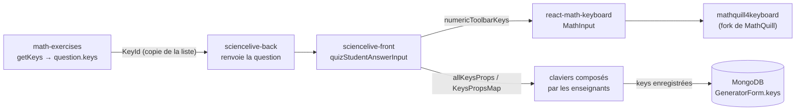

# react-math-keyboard : documentation technique

> Rédigée à partir de la lecture du code. Elle décrit la structure et les mécanismes, pas les chiffres (versions,
> nombre de touches), qui se lisent à la source. Le `README.md` (en anglais) reste la documentation d'usage publique
> du paquet ; ce document s'adresse à ceux qui le maintiennent.
>
> Dans le workspace `heureuxhasard/monorepo` : `docs/react-math-keyboard/README.md` donne le LaTeX exact produit par
> chaque touche, ce que le parser de `math-exercises` en comprend et les anomalies relevées ;
> `docs/mathquill/README.md` décrit le fork de MathQuill (§5).

## 1. Rôle

`react-math-keyboard` est une bibliothèque React publiée sur npm (paquet `react-math-keyboard`, dépôt public GitHub
`heureuxhasard/react-math-keyboard`, d'abord sur le compte de Robin). Elle fournit un composant, `MathInput` : un champ de saisie
MathQuill où l'on écrit des expressions mathématiques (en LaTeX) ou du texte, et un **clavier virtuel**
personnalisable, pensé pour le mobile.

C'est le clavier de MathLive et XPLive : le front (`sciencelive-front`) l'utilise pour toutes les réponses libres des
élèves et pour les claviers que les enseignants composent. Il repose sur un **fork de MathQuill** publié sous le nom
`mathquill4keyboard` (§5).

## 2. Stack et build

| Élément | Détail |
|---|---|
| Langage | TypeScript, React (`react` et `react-dom` en dépendances pairs : c'est l'application qui les fournit) |
| Dépendances | `mathquill4keyboard` (le fork de MathQuill), `jquery` (MathQuill l'attend dans `window.jQuery`), `react-device-detect` (détection du mobile) |
| Build | `rollup.config.mjs` : sorties CommonJS (`dist/cjs`) et ESM (`dist/esm`), types regroupés dans `dist/index.d.ts` ; le CSS est injecté dans le JavaScript (`rollup-plugin-postcss`) |
| Publication | seul `dist/` est publié (`files`) ; `prepublishOnly` lance le build |
| Démo | Storybook (`src/mathInput/mathInput.stories.tsx`) ; liens CodeSandbox dans le README |

Commandes :

| Commande | Effet |
|---|---|
| `npm run dev` | build rollup en continu |
| `npm run build` | build de `dist/` ; le plugin `rollup-plugin-visualizer` est réglé avec `open: true` et ouvre une fenêtre de navigateur à chaque build |
| `npm run storybook` | Storybook sur le port 6006 |
| `npm run build-storybook` | Storybook statique dans `storybook-static/` (dossier versionné) |
| `npm publish` | publication npm, après le build de `prepublishOnly` |

## 3. Structure du code

```
src/
├── index.ts                 API publique (ci-dessous)
├── mathInput/
│   ├── mathInput.tsx        le composant MathInput : chargement de MathQuill, ouverture et fermeture du clavier
│   ├── mathfieldContext.ts  contexte React qui donne le MathField aux touches
│   ├── embedObjects.ts      objets intégrés au champ (mots « ou », « et », « Aucun »…)
│   ├── showKeyboardButton.tsx
│   ├── style.css
│   └── mathInput.stories.tsx
├── keyboard/
│   ├── keyboard.tsx         bascule entre le clavier numérique et le clavier alphabétique
│   ├── layout/              numericLayout.tsx, alphabetLayout.tsx
│   ├── toolbar/             toolbar.tsx (touches choisies par l'application), toolbarTabs.tsx (onglets par groupe)
│   └── keys/
│       ├── keyIds.ts        le type KeyId : identifiants de toutes les touches
│       ├── keys.ts          allKeysProps (toutes les touches) et KeysPropsMap (KeyId → KeyProps)
│       ├── keyGroup.ts      groupes de touches (onglets) et langues
│       ├── key.tsx          le composant Key et le type KeyProps ; letterKey.tsx, utilityKeys.tsx : touches
│       │                    du clavier alphabétique et touches utilitaires (effacer, flèches…)
│       └── <famille>Keys.ts une famille de touches par fichier : nombres, lettres, opérations, fonctions,
│                            trigonométrie, ensembles, suites, probabilités, complexes, algèbre, géométrie,
│                            matrices, lettres grecques, unités, grandeurs physiques, atomes, molécules, mots,
│                            ponctuation
├── style/                   thèmes de couleur (applyTheme, keyboardTheme)
├── components/portal.tsx    rend le clavier dans un portail en bas de <body>
├── types/                   types MathQuill et window
└── utils/textifyInLatex.ts  entoure les lettres de \text{} (formules chimiques)
```

**API publique** (`src/index.ts`) : `MathInput` en export par défaut ; les types `KeyId`, `KeyProps`,
`MathInputProps` ; `allKeysProps` et `KeysPropsMap`, qui servent aux applications à construire leurs propres
claviers.

## 4. Mécanismes

### 4.1 Le champ MathQuill

Au premier rendu, `MathInput` place jQuery dans `window.jQuery`, charge le CSS et le JavaScript de
`mathquill4keyboard`, enregistre les objets intégrés (ceux de `embedObjects.ts`, plus ceux passés par
`registerEmbedObjects`), puis crée un `MathField` avec les options `supSubsRequireOperand`, `maxDepth: 5` et
`restrictMismatchedBrackets`. À chaque modification, `setValue` reçoit le LaTeX du champ. L'application peut
récupérer le `MathField` (`setMathfieldRef`) pour utiliser toute l'API MathQuill, et une fonction d'effacement
(`setClearRef`).

Sur mobile, le `textarea` interne de MathQuill passe en `readonly` pour que le clavier natif du téléphone ne s'ouvre
pas : seul le clavier virtuel sert à la saisie.

### 4.2 Ouverture et fermeture du clavier

Le clavier s'affiche dans un portail fixé en bas de la page. Les demandes d'ouverture et de fermeture passent par une
temporisation de 300 ms, pour éviter les clignotements quand le focus change de champ. Un clic en dehors du champ et
du clavier le ferme, ainsi que la touche Échap ; avec `closeKeyboardOnGoBack`, le bouton « retour » du navigateur
ferme le clavier au lieu de quitter la page. Pour que le clavier ne masque pas le champ, le composant ajoute une marge
de 300 px en bas de `<body>` (ou de l'élément `rootElementId`) et fait défiler la page.

### 4.3 Les touches

Une touche est décrite par un `KeyProps` : un identifiant (`KeyId`), un libellé (texte, TeX ou SVG), et une action.
L'action est soit une instruction MathQuill (`mathfieldInstructions` : méthode `write`, `cmd`, `keystroke` ou
`typedText`, et son contenu), soit une fonction (`onClick`), éventuellement suivie de frappes (`postKeystrokes`).
`keypressId` indique la touche du clavier physique qui lui correspond, pour `forbidOtherKeyboardKeys`.

L'application choisit les touches de la barre d'outils avec `numericToolbarKeys` : des `KeyId` (résolus par
`KeysPropsMap`) ou des `KeyProps` complets pour des touches sur mesure. Un `KeyId` inconnu du clavier n'est pas une
erreur dans la barre d'outils (`toolbar.tsx`) : la touche s'affiche avec son identifiant comme libellé TeX et écrit cet
identifiant dans le champ ; avec `forbidOtherKeyboardKeys`, en revanche, il fait planter le composant (§8).

### 4.4 Props de MathInput absentes du README

Le README décrit les props principales. Le code en accepte d'autres :

| Prop | Effet |
|---|---|
| `color` | thème de couleur du clavier (`grey` par défaut, `blue`, `purple`, `orange`, `green`, `pink`) |
| `scrollType` | défilement de la fenêtre (`window`, par défaut) ou du champ lui-même (`raw`) à l'ouverture du clavier |
| `scrollTriesToShowLastElement` | à l'ouverture, essaie de garder visible le dernier champ de la page |
| `forbidOtherKeyboardKeys` | n'accepte du clavier physique que les chiffres, opérateurs usuels et touches de la barre d'outils |
| `forbidPaste` | interdit le collage dans le champ |
| `parenthesisShouldNotProduceLeftRight` | parenthèses simples au lieu de `\left( \right)` |
| `timesShouldProduceStar` | la touche de multiplication produit `*` |
| `registerEmbedObjects` | objets intégrés supplémentaires (identifiant, HTML, texte, LaTeX) |
| `tabShouldSkipKeys` | la touche Tab saute les touches du clavier virtuel |
| `withShowKeyboardButton` | le clavier ne s'ouvre plus au focus mais par un bouton à côté du champ |
| `LoadingComponent` | composant affiché pendant le chargement de MathQuill |
| `closeKeyboardOnGoBack` | le bouton « retour » du navigateur ferme le clavier |
| `isPaddingPersistent` | garde la marge du bas après la fermeture du clavier |
| `container` | déclarée mais inutilisée |

## 5. Le fork de MathQuill : `mathquill4keyboard`

MathQuill est utilisé à travers un fork, dépôt public GitHub `heureuxhasard/mathquill` (fork de
`mathquill/mathquill`), publié sur npm sous le nom `mathquill4keyboard`. Il ajoute la notation française (virgule
décimale, `×` pour la multiplication), le symbole `\mathbb{D}` et les matrices. Ce qu'il change, son historique, sa
construction et sa publication : `docs/mathquill/README.md` du workspace.

Point à connaître côté application :

- Le front charge aussi `mathquill4keyboard` directement (`Components/Math/staticMathField.tsx`, pour afficher des
  formules sans clavier) sans le déclarer dans ses dépendances : il profite de celle de `react-math-keyboard`.

## 6. Place dans MathLive / XPLive



- Chaque générateur de `math-exercises` choisit les touches utiles à sa question (`getKeys`). La lib a **sa propre
  copie** de la liste des identifiants (`src/types/keyIds.ts`) et du type `KeyProps` (`src/types/keyProps.ts`) : elle
  ne dépend pas du paquet. Rien ne vérifie que les deux listes restent alignées ; une touche ajoutée dans la lib mais
  pas dans le clavier s'affiche avec son identifiant brut.
- Le front passe `question.keys` à `numericToolbarKeys` (détail des props qu'il passe :
  `docs/react-math-keyboard/README.md` §2 du workspace) (`Activities/Quizzes/Components/Student/quizStudentAnswerInput.tsx`
  et les champs de tableaux) et enveloppe le composant dans `Components/KeyBoards/mathInput.tsx`.
- Les enseignants composent des claviers avec `allKeysProps` et `KeysPropsMap`
  (`Layouts/GeneratorForm/keyboardConstructor.tsx`,
  `Activities/Quizzes/Components/Settings/FreeQuestionEditor/quizKeyboardEditor.tsx`) ; le back enregistre ces `KeyId` en base
  (`GeneratorForm.keys`). **Un `KeyId` ne doit donc jamais être renommé ni supprimé** : les claviers déjà enregistrés
  le référencent.

Ajouter une touche :

1. l'ajouter à `keyIds.ts` et à la famille concernée dans `src/keyboard/keys/` (et à un groupe si elle doit
   apparaître dans un onglet) ;
2. publier une nouvelle version du paquet, puis mettre à jour la dépendance du front ;
3. ajouter le même identifiant à `src/types/keyIds.ts` dans `math-exercises` pour que les générateurs puissent
   l'utiliser.

## 7. Git, versions, publication

- Branche par défaut `main`, branche `dev`, branches de fonctionnalité.
- La version est incrémentée à la main dans `package.json` (commits dont le message est le numéro de version), sans
  tag ; la publication se fait depuis un poste, avec le compte npm du mainteneur. Rien ne garantit que la version
  publiée corresponde à un commit : il arrive que la version sur npm soit en avance sur le `package.json` du dépôt.
- La branche `gh-pages` contient une ancienne démo.

## 8. Points d'attention

1. **Build sous Node 22** : `rollup.config.mjs` importe `package.json` avec la syntaxe `assert { type: "json" }`,
   que Node 22 refuse (vérifié sur un fichier isolé). Passer à `with { type: "json" }` ou lire le fichier autrement.
2. **Versions et publication** : pas de tag, publication depuis un poste ; publier depuis une CI, sur tag, comme pour
   `math-exercises`, rendrait chaque version retrouvable dans git.
3. **Deux listes de `KeyId`** (clavier et `math-exercises`) sans contrôle d'alignement : exporter la liste depuis le
   paquet et l'importer dans la lib, ou ajouter un test qui compare les deux.
4. **Aucun test automatisé** : seulement des stories Storybook, et pas encore de CI. Des tests des touches (instruction MathQuill produite
   pour chaque `KeyId`) protégeraient les claviers enregistrés en base.
5. **Licence** : le fichier `LICENSE` est une licence MIT, `package.json` déclare `ISC`, et `LICENSE.md` est vide.
6. **Fichiers versionnés** : `package-lock.json` est listé dans `.gitignore` mais versionné ; `storybook-static/`
   (build) est versionné.
7. **Taille du champ** : la marge de 300 px et les seuils de défilement sont codés en dur dans `mathInput.tsx`.
8. **jQuery** : le fork a récupéré la version amont de MathQuill qui se passe de jQuery ; le paquet charge encore
   jQuery pour MathQuill et pour les marges (`$("body").css(...)`), une dépendance qui pourrait disparaître.
9. **Traces de mise au point** : un `console.log` dans la gestion du bouton « retour » (`handlePopState`).
10. **`KeyId` inconnu et `forbidOtherKeyboardKeys`** : pour construire la liste des touches physiques permises,
    `mathInput.tsx` lit `KeysPropsMap.get(key)!.keypressId` sans vérifier que la touche existe. Un `KeyId` absent du
    clavier (par exemple une touche ajoutée dans `math-exercises` mais pas encore ici) lève alors une erreur, alors que
    la barre d'outils, elle, l'affiche sans planter.
